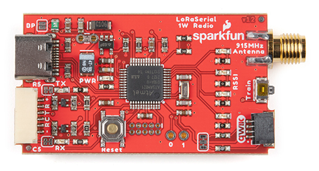
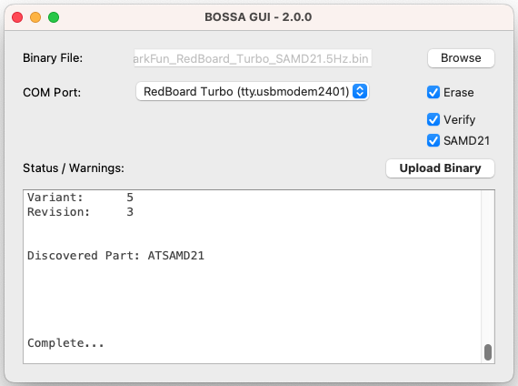
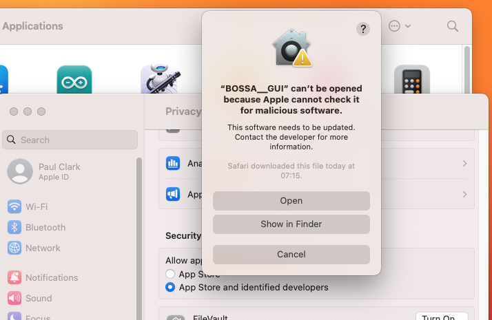

# SparkFun BOSSA GUI

<p align="center">
  <a href="https://github.com/sparkfun/SparkFun_BOSSA_GUI/issues" alt="Issues">
    </a>
  <a href="https://github.com/sparkfun/SparkFun_BOSSA_GUI/actions" alt="Actions">
    </a>
  <a href="https://github.com/sparkfun/SparkFun_BOSSA_GUI/blob/main/LICENSE.md" alt="License">
    </a>
  <a href="https://twitter.com/intent/follow?screen_name=sparkfun">
    </a>
</p>

[](https://www.sparkfun.com/products/19311)

*[SparkFun LoRaSerial Kit - 915MHz (WRL-19311)](https://www.sparkfun.com/products/19311)*


Our BOSSA (Basic Open Source SAM-BA Application) GUI is a convenient way to upgrade the firmware on many SAMD21 and SAMD51 boards. We wrote it to make it easy to upgrade the firmware on our
[LoRaSerial boards](https://www.sparkfun.com/products/19311), but you can use it to upload binary firmware to any board running the SAM-BA bootloader.

* The BOSSA GUI is a PyQt5 'wrapper' for the excellent [Python SAM-BA Loader](#thanks)
* Our GUI makes it easy to select the firmware file and COM port
* The actual upgrade is done by the Python SAM-BA Loader
  * You can run the Loader from the command line too. See [_Command Line_ below](#command-line)

If you need to install the application, see the [Installation](#installation) section of this page.

## Using the BOSSA GUI

* Click ```Browse``` and select the firmware file you'd like to upload (should end in _.bin_)
* Attach the SAMD target board over USB
* For SAMD51 boards:
  * Double-click the board's reset button to put the SAMD51 into bootloader mode (indicated by the fading LED)
* For SAMD21 boards:
  * Check the SAMD21 check-box
  * The GUI will attempt to put the SAMD21 into bootloader mode automatically
* Select the COM port from the dropdown menu
  * On macOS, two ports will appear. Select the one called ```tty.usbmodem```



* Click ```Upload Binary```
  * The GUI will detect the board, erase, program and verify the firmware and then reset the board

For SAMD21 boards, the GUI will attempt to put the SAMD into bootloader mode automatically. This feature is machine-dependent and occasionally fails to work correctly. If it is not working for you:

* Uncheck the SAMD21 check-box
* Double-click the board's reset button to put the SAMD21 into bootloader mode (indicated by the fading LED)
* Select the COM port from the dropdown menu
* Click ```Upload Binary```

## Installation

You will find the zipped BOSSA_GUI executables attached to each [release](https://github.com/sparkfun/SparkFun_BOSSA_GUI/releases).

[](https://github.com/sparkfun/SparkFun_BOSSA_GUI/releases)

### Windows Installation

* Download the GitHub [release](https://github.com/sparkfun/SparkFun_BOSSA_GUI/releases) zip file - *BOSSA__GUI.win.zip*
* Unzip the release file - *BOSSA__GUI.win.zip*
* This results in the application executable, *BOSSA__GUI.exe*
* Double-click *BOSSA__GUI.exe* to start the application
* The BOSSA__GUI executable is not signed, so Windows will not run the application and will display a warning dialog


* Click **More Info**


* Click **Run anyway** to start the GUI

### macOS Installation

* Download the GitHub [release](https://github.com/sparkfun/SparkFun_BOSSA_GUI/releases) file - *BOSSA__GUI.dmg*


* Double-click the *BOSSA__GUI.dmg* file to mount the disk image. A Finder window will open:


* Install the BOSSA__GUI app by dragging it onto the _Applications_ in the Finder Window, or copying the file to a desired location
* Once complete, unmount the BOSSA__GUI disk image by right-clicking on the mounted disk in Finder and ejecting it


To launch the BOSSA__GUI application:

* Double-click BOSSA__GUI app icon to launch the application
* The BOSSA__GUI app is not signed, so macOS will not run the application and will display a warning dialog. Click ```OK``` to dismiss the window


* Open the macOS _Settings_ and navigate to _Privacy and Security_
* Scroll down and click ```Open Anyway``` to launch the BOSSA__GUI app


* A second warning dialog will appear. Click ```Open``` to open the app



* Two COM ports will appear when a board is connected. Select the one called ```tty.usbmodem```


### Linux

* Download the GitHub [release](https://github.com/sparkfun/SparkFun_BOSSA_GUI/releases) file - *BOSSA__GUI.linux.gz*
* Unzip the release file - *BOSSA__GUI.linux.gz*
* Un-gzip the file, either by double-clicking in on the desktop, or using the `gunzip` command in a terminal window. This results in the file *BOSSA__GUI* 
* To run the application, the file must have *execute* permission. This is performed by selecting *Properties* from the file right-click menu, and then selecting permissions. You can also change permissions using the ```chmod``` command in a terminal window.
* Once the application has execute permission, you can start the application a terminal window. Change directory to the application location and issue ```./BOSSA__GUI```

### Python Package

The BOSSA__GUI app is also provided as an installable Python package. This is advantageous for platforms that lack a pre-compiled application. 

To install the Python package:

* Download the [package file](https://github.com/sparkfun/SparkFun_BOSSA_GUI/releases) - *BOSSA_GUI-2.0.0.tar.gz* (note - the version number might vary)
* At a command line - issue the package install command:
  * `pip install BOSSA_GUI-2.0.0.tar.gz`
* Once installed, you can start the BOSSA__GUI app by issuing the command ```./BOSSA__GUI``` at the command line. (To see the command, you might need to start a new terminal, or issue a command like `rehash` depending on your platform/shell)

Notes:
* A path might be needed to specify the install file location.
* Depending on your platform, this command might need to be run as admin/root.
* Depending on your system, you might need to use the command `pip3`

The GUI is uninstalled by issuing this pip command: 
* `pip uninstall BOSSA__GUI`

### Raspberry Pi

We've tested the GUI on 64-bit Raspberry Pi Debian. You will need to use the **Python Package** to install it.

Notes:
* On 32-bit Raspberry Pi, with both Python 2 and Python 3 installed, use `sudo pip3 install BOSSA_GUI-2.0.0.tar.gz`
* On 64-bit Raspberry Pi, use `sudo pip install BOSSA_GUI-2.0.0.tar.gz`
* By default, the executable will be placed in `/usr/local/bin`
* The `sudo` is required to let `setup.py` install `python3-pyqt5` and `python3-pyqt5.qtserialport` using `sudo apt-get install`

When the SAMD goes into bootloader mode, it may cause a new drive dialog to appear. Click ```Cancel``` to dismiss it


## Example Firmware

The [Test_Sketches](./Test_Sketches) folder contains some example firmware binaries for the SAMD21 RedBoard Turbo and the SAMD51 Thing Plus.
These blink the on-board LED at different speeds and are a useful way of confirming that the code is being uploaded successfully.

## Command Line

You can run the Python SAM-BA Loader direct from the command line. Download the [full repo zip file](https://github.com/sparkfun/SparkFun_BOSSA_GUI/archive/refs/heads/main.zip).
Extract it. Python SAM-BA Loader is in the ```BOSSA_GUI\SAMBALoad``` sub-folder.

* ```python SAMBALoader.py``` will display the help. So will ```python SAMBALoader.py -h``` or ```python SAMBALoader.py --help```
* ```python SAMBALoader.py -p COM1 info``` will display part information from the board on COM1 (Windows). Replace with ```/dev/ttyACM0``` if you are on Linux.
* ```python SAMBALoader.py -p COM1 erase -a 0x2000``` will erase the flash memory starting at address 0x2000 (SAMD21). Use 0x4000 for SAMD51.
* ```python SAMBALoader.py -p COM1 write -a 0x2000 -f myCode.bin``` will write ```myCode.bin``` to flash memory, starting at address 0x2000 (SAMD21). Use 0x4000 for SAMD51.
* ```python SAMBALoader.py -p COM1 verify -a 0x2000 -f myCode.bin``` will verify the flash memory against ```myCode.bin```, starting at address 0x2000 (SAMD21). Use 0x4000 for SAMD51.
* ```python SAMBALoader.py -p COM1 read -a 0x2000 -l 0x1000 -f myCode.bin``` will read 0x1000 bytes from flash memory, starting at address 0x2000 and write them into ```myCode.bin```. Use 0x4000 for SAMD51.
* Add the ```--reset``` switch to reset the board when the operation is complete. E.g. ```python SAMBALoader.py -p COM1 --reset verify -a 0x2000 -f myCode.bin```
* Add the ```-v``` switch to display helpful verbose messages. Add ```-vv``` for even more verbose messages.

## Thanks

Big thanks go to Dean Camera (@abcminiuser) and the contributors to [Python SAM-BA Loader](https://github.com/abcminiuser/sam-ba-loader).

Big thanks go to Scott Shumate (@shumatech) and the contributors to [BOSSA](https://github.com/shumatech/BOSSA).

## Repository Contents

* **[/BOSSA_GUI](./BOSSA_GUI)** - Python3 PyQt5 source (.py)
* **[/SAMBALoad](./BOSSA_GUI/BOSSA_GUI/SAMBALoad)** - Python source for the SAM-BA Loader
* **[/.github/workflows](./.github/workflows)** - YAML for the GitHub Build Actions
  * **[/.github/workflows/build-and-release.yml](./.github/workflows/build-and-release.yml)** - YAML for the GitHub Build-And-Release Action
  * Builds the zipped executables, creates a release and attaches the zip files as Assets
  * Click on the [Releases](https://github.com/sparkfun/SparkFun_BOSSA_GUI/releases) and then click on the latest release. The zipped executables are attached as Assets
  * **[/.github/workflows/non-release-build.yml](./.github/workflows/non-release-build.yml)** - YAML for the GitHub Non-Release-Build Action
  * Builds the zipped executable but does not release it
  * Click on the repo **Actions** tab and then click on the latest **non-release-build** workflow run. The zipped executable is attached as an Artifact
  * **[/.github/workflows/build-windows.yml](./.github/workflows/build-windows.yml)** - YAML for the GitHub Build Action - for Windows

## License Information

This product is _**open source**_! 

Please review the LICENSE.md file for license information. 

If you have any questions or concerns on licensing, please contact technical support on our [SparkFun forums](https://forum.sparkfun.com/viewforum.php?f=152).

Distributed as-is; no warranty is given.

- Your friends at SparkFun.
